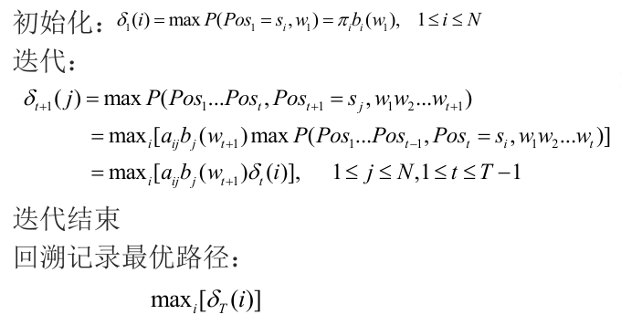

# 自然语言处理

## Lecture1:概要

+ 自然语言处理： 利用计算机为工具对自然语言进行各种加工处理、信息提取及应用的技术。
+ 自然语言理解：强调对语言含义和意图的深层次解释
+ 计算语言学：强调可计算的语言理论
+ nlp任务有：
  + 自然语言分析：分词、词性标注、依存句法分析、语义分析、篇章分析
  + 自然语言生成：句子生成、翻译、对话等
  + 应用：文本分类、信息检索、问答系统、情感分析等

+ nlp困难：
  + 歧义、语言表达的多样性动态性、上下文、对世界知识（语言无关）的利用和处理

## Lecture2:基于规则的自然语言处理方法

+ 分词是指根据某个分词规范，把一个“字”串分成“词”串。

  分词规范

  + 难以确定何谓汉语的“词”
  + 单字词与语素的界定：猪肉、牛肉
  + 词与短语(词组)的界定：黑板、黑布

+ 伪歧义字段指在任何情况下只有一种切分，根据歧义字段本身就能消歧；真歧义字段指在不同的情况下有多种切分， 根据歧义字段的上下文来消歧

  常见歧义字段：

  + 交集型歧义字段，ABC切分成AB/C或A/BC。

    “独立/自主/和/平等/独立/的/原则”
    “讨论/战争/与/和平/等/问题”

  + 组合型歧义字段

     “他/骑/在/⻢/上”
    “⻢上/过来”

  + 混合型歧义，由上两种混合

+ 常用分词方法：

  + 正向最大匹配(FMM)或逆向最大匹配(RMM)，从左至右(FMM)或从右至左(RMM)，取最⻓的词，会忽略“词中有词”的现象：“幼儿园 地 节目”
  + 双向最大匹配，分别采用FMM和RMM进行分词，如果结果一致，则认为成功；否则，采用消歧规则进行消歧(交集型歧义)
  + 正向最大、逆向最小匹配，发现组合型歧义
  + 逐词遍历匹配，在全句中取最⻓的词，去掉之，对剩下字符串重复该过程
  + 设立切分标记，收集词首字和词尾字，把句子分成较小单位，再用某些方法切分
  + 全切分，获得所有可能的切分，选择最大可能的切分

+ 规则方法：
  + 利用歧义字串、前驱字串和后继字串的句法、语义和语用信息
  + 利用正则表达式匹配

+ 词性标注：为句子中的词标上预定义类别集合(标注集)中的类，为后续的句法/语义分析提供必要的信息

## Lecture3:语言模型

### N-Gram

+ 语言模型是用来刻画一个句子(词串序列)存在可能性的概率模型

+ 统计语言模型N-Gram：$P(W)=P(w_1...w_n)=p(w_1)p(w_2|w_1)...p(w_n|w_1,...w_{n-1})$
  
  有限视野假设(Limited Horizon)：当前词出现的概率只和它前面的k个词相关，称为k阶马尔科夫链。
  
  N-1阶马尔可夫链我们称之为N元语言模型，假设词汇量为K，则N元模型的参数数量有$K^N$。

  使用相对频率估计计算$p(w_2|w_1)=\frac{p(w_1w_2)}{p(w_1)}=\frac{Count(w_1w_2)}{Count(w_1)}$，其实就是最大似然估计

+ Zipf Law：如果以词频排序,词频和排位的乘积是一个常数，大致能用一条直线$y = -k x+b$拟合。其隐含的意义是大部分的词都稀有，语言中频繁出现的事件是有限的，不可能搜集到足够的数据来得到稀有事件的完整概率分布。

+ 数据稀疏问题：没有足够的训练数据，对于未观测到的数据，出现零概率现象。

  解决办法：参数平滑。给没观察到的N元组合赋予一个概率值，以保证词序列总能通过语言模型得到一个概率值。高概率调低点，小概率或者零概率调高点，并保证所有概率和为1。

  

+ 训练集Training Data：用来建立模型,获得模型参数
  测试集Test Data：从训练集以外独立采样，反映系统面对真实世界的处理能力
  交叉确认集Cross-Validation Data， 又称为held-out data、development data：从训练集和测试集以外独立采样，主要用来帮助做设计决策和参数设定

+ 如何评价模型的好坏。

  困惑度(Perplexity)： Perplexity is the probability of the test data，normalized by the number of words。

  测试集有m个句子，取所有句子的对数概率乘积$\log\prod_{i=1}^mP(s_i)$，则
  $$
  Perplexity=2^{-l},l =\frac{1}{m}\sum_{i=1}^m\log P(s_i)
  $$
  困惑度的思想是**给测试集的句子赋予较高概率值的语言模型较好**，句子概率越大，语言模型越好，困惑度越小

### 线性语言模型

+ 建模条件概率p(y|x)：$p_w(Y=y|X=x)=\frac{\exp(w\phi(x,y))}{\sum_{y'}\exp(w\phi(x,y'))}\\
  \log p_w=w\phi(x,y)-\log Z_w(x)$
  
  Z是配分函数，w是参数，$\phi$是特征函数。
  
  将其运用在N-Gram中得到对数线性N-Gram语言模型

### 神经网络语言模型

+ Feedforward Neural Network Language Model (Bengio et al., 2003)

  高复杂度，但是是SOTA的方法；自动抽取特征，泛化性能好

  N-Gram：简单强大，数据稀疏，泛化性能缺乏。

## Lecture4:文本分类

### 朴素贝叶斯模型

+ 给定文档D，$\arg\max_{c_k}P(c_k|D)=\arg\max_{c_k} P(D|c_k)P(c_k)$

+ 文本表示：Bag-of-Words

+ Bernoulli document model：a document is represented by a binary feature vector,whose elements indicate absence or presence of corresponding word in the document

  假设词袋里有$V$个词，则文本D表示为一个长度为$V$的0-1向量。一共N个文档。

  

  令$n_k(w_t)$表示类别为$c_k$且出现了词$w_t$的文档数量，$N_k$为类别为$c_k$的文档数量，则

  对于$p(w_t|c_k)=\frac{n_k(w_t)}{N_k}$，先验概率$p(c_k)=\frac{N_k}{N}$。

  则最大似然可写为：
  
  $\arg\max_{c_k}P(c_k|D_j)=\arg\max_{c_k}P(c_k)\prod_{t=1}^{V}[D_{jt}P(w_t|c_k)+(1-D_{jt})(1-P(w_t|c_k))]$
  
+ Multinomial model：不同于伯努利模型的0-1表示，它在特征中加入了词频信息

  Generates a document as a bag of words — includes what words are in the document, and how many times they occur

  

  $D_i$是第i个文档的特征向量，其第t个元素$D_{it}$是第t个词$w_t$出现在$D_i$中的数量。$n_i=\sum_t D_{it}$是$D_i$的词总数。

  $z_{ik}=1$表示第i个文档属于类$c_k$，否则为0，$N_k$为类别为$c_k$的文档数量，一共N个文档。

  则先验概率$p(c_k)=\frac{N_k}{N}$。
  $$
  p(w_t|c_k)=\frac{\sum_{i=1}^N D_{it}z_{ik}}{\sum_{s=1}^{V}\sum_{i=1}^ND_{is}z_{ik}}
  $$
  事实上，$p(w_t|c_k)$就等于{在所有类别为$c_k$的文档中词$w_t$出现的总和}/{配分函数}，配分函数就是所有的词在所有该类别的文档中出现的数量总和。

  最大似然：

  

  实例见https://www.cnblogs.com/alan-blog-TsingHua/p/10018810.html

  出现0概率：Add-one smoothing，在计算类条件概率$p(w_t|c_k)$时，分子加1，分母加总词数

  

### Linear Model

+ 从输入x中构建特征向量f(x)，对于类别y，计算其score为 $w^Tf_i(y)$。选择一个score最大的作为预测类别。

+ 学习过程：寻找最符合训练集的参数w。其评价指标可以用acc或者F1。

  

  令$l_i(y)=l(y,y_i^*)$为损失函数，则目标是最小化：
  $$
  \min_w\sum_i l_i(\arg\max_y w^Tf_i(y))
  $$

+ 最大熵模型：逻辑回归

  

  加上正则化，转为最小化：
  $$
  \min_w k\|w\|^2-\sum_i(w^Tf_i(y_i^*)-\log\sum_y\exp(w^Tf_i(y)))
  $$

+ 特征选择：

  + 必须衡量 停用词、词频、互信息、卡方检验

  + 特征过滤

    - 停用词
    - 基于文档频率(DF)的特征提取法
      从训练预料中统计出包含某个特征的文档的频率(个数),然后根据设定的阈值，当该特征项的DF值小于某个阈值时，从特征空间中去掉该特征项，因为该特征项使文档出现的频率太低，没有代表性；当该特征项的DF值大于另外一个阈值时，从特征空间中也去掉该特征项，因为该特征项使文档出现的频率太高，没有区分度
    - 信息增益法
      信息增益(IG)法依据某特征项$t_i$为整个分类所能提供的信息量多少来衡量该特征项的重要程度，从而决定对该特征项的取舍。某个特征项$t_i$的信息增益是指有该特征或没有该特征时，为整个分类所能提供的信息量的差别，其中，信息量的多少由熵来衡量。因此，信息增益即不考虑任何特征时文档的熵和考虑该特征后文档的熵的差值:

    $$
    \begin{aligned}
    Gain(t_i) &=Entropy(S)-Expected\ Entropy(S_{t_i})\\
    &=\{-\sum_{j=1}^MP(C_j)\cdot\log P(C_j)\}-\{ P(t_i)\cdot[-\sum_{j=1}^{M}P(C_j|t_i)\cdot\log P(C_j|t_i)]\\
    &\ \ \ +P(\bar{t_i})\cdot[-\sum_{j=1}^{M}P(C_j|\bar{t_i})\cdot\log P(C_j|\bar{t_i})]\}
    \end{aligned}
    $$

    其中$P(C_j)$表示$C_j$类文档在预料中出现的概率，$P(t_i)$表示语料中包含特征项$t_i$的文档的概率，$P(C_j|t_i)$表示文档包含特征项$t_i$时属于$C_j$类的条件概率，$P(\bar{t_i})$表示语料中不包含特征项$t_i$的文档的概率，$P(C_j|\bar{t_i})$表示文档不包含特征项$t_i$时属于$C_j$的条件概率,$M$表示类别数

    - mutual information(互信息法)
    - $X^2$test

+ mutual information:

  两个随机变量X，Y的互信息定义为
  $$
  I(X,Y)=\sum_{y}\sum_x p(x,y)\log(\frac{p(x,y)}{p(x)p(y)})
  $$

+ TF-IDF：TF意思是词频(Term Frequency)，IDF意思是逆文本频率指数(Inverse Document Frequency)

  $TF_{ij}=\frac{f_{ij}}{\max_i\{f_{ij}\}}=\dfrac{某个词在文章中的出现次数}{文章中出现最多词的个数}$。$f_{ij}$指在文档j中词i的频率。

  $DF_i$是包含词i的文档数量，$IDF_i=\log_2(\frac{N}{DF_i})=\log \dfrac{语料库的文档总数}{包含该词的文档数+1}$。N为文档总数。

  tf-idf就是这两个相乘，$w_{ij}=TF_{ij}IDF_i=TF_{ij}\log_2(\frac{N}{DF_i})$。一个词如果常在某文档出现而在其他文档出现少则会有大权重。
  
  Vocab = set of all n-grams in corpus
  
  Document = n-grams in document w.r.t vocab with multiplicity 
  
  For bigram: 
  
  Sentence 1: "The cat sat on the hat" 
  
  Sentence 2: "The dog ate the cat and the hat” 
  
  Vocab = { the cat, cat sat, sat on, on the, the hat, the dog, dog ate, ate the, cat and, and the} 
  
  Sentence 1: { 1, 1, 1, 1, 1, 0, 0, 0, 0, 0} 
  
  Sentence 2 : { 1, 0, 0, 0, 0, 1, 1, 1, 1, 1} 
  

### Measure of performance

+ 

+ 

  这是多分类形式

## Lecture5:情感分类

+ 包括情感分类，方面级别情感分类，观点挖掘等。

## Lecture6:表示学习

+ 表示学习是一组学习特征的技术：将原始数据输入转换为可以在机器学习任务中有效利用的表示。

+ One-hot Encoding：不考虑词之间的联系，只用$w_i=[0,...,1,...,0]$表示词。一个句子的词袋向量即词的one-hot向量相加。

  缺点：不同向量之间没有联系，是正交的。词之间有同义词、近义词等，如果查询compute信息，只会返回包含compute的文档，而包含laptop的文档则不会返回。

+ 希望找到一种模型，能够捕获到**单词之间的相关性**。如果**两个单词之间有很强的相关性，那么当一个单词出现时，往往意味着另一个单词也应该出现(同义词)；**反之，如果查询语句或者文档中的某个单词和其他单词的相关性都不大，那么这个词很可能表示的是另外一个意思

+ Latent Semantic Index构建了一个词-文档矩阵n*m，并对其做奇异值分解$X=U\Sigma V^T$，SVD可以看作是从单词-文档矩阵中发现不相关的索引变量(因子)，将原来的数据映射到**语义空间内**。在单词-文档矩阵中不相似的两个文档，可能在语义空间内比较相似。我们只保存$\Sigma$中最大的K个奇异值，以及U和V中对应的K个奇异向量，K个奇异值构成新的对角矩阵，K个左奇异向量和右奇异向量构成新的矩阵，得到变换后的词-文档矩阵X‘。还原后的X’与X差别很大，这是因为我们认为之前X存在很大的噪音，X’是对X处理过同义词和多义词后的结果。

  缺点：计算量大、是个线性模型难以处理非线性的依赖、如何确定超参K、没有考虑词的顺序、难以合并新词和新文档

+ Word2vec：Continuous Bag of Word

  CBoW模型：等价于一个词袋模型的向量乘以一个Embedding矩阵，从而得到一个连续的embedding向量。

  Skip-gram模型的本质是计算输入word的input vector与目标word的output vector之间的余弦相似度，并进行softmax归一化。我们要学习的模型参数正是这两类词向量。

  直接对词典里的V个词计算相似度并归一化，显然是一件极其耗时的impossible mission。为此，Mikolov引入了两种优化算法：层次Softmax（Hierarchical Softmax）和负采样（Negative Sampling）

  它的输入是采用One-Hot编码的词汇表向量，它的输出也是One-Hot编码的词汇表向量。使用所有的样本，训练这个神经元网络，等到收敛之后，从输入层到隐含层的那些权重，便是每一个词的采用Distributed Representation的词向量。

  negative sampling：当通过（”fox”, “quick”)词对来训练神经网络时，我们回想起这个神经网络的“标签”或者是“正确的输出”是一个one-hot向量。也就是说，对于神经网络中对应于”quick”这个单词的神经元对应为1，而其他上千个的输出神经元则对应为0。使用负采样，我们通过随机选择一个较少数目（比如说5个）的“负”样本来更新对应的权重。(在这个条件下，“负”单词就是我们希望神经网络输出为0的神经元对应的单词）。并且我们仍然为我们的“正”单词更新对应的权重（也就是当前样本下”quick”对应的神经元仍然输出为1）。

  https://zhuanlan.zhihu.com/p/61635013

+ Distributional similarity-based representations 

  - LSI
  - First Propose
  - Word2vec
  - Doc2Vec

## Lecture7:词性标注与HMM

+ 兼类词：一个词具有两个或者两个以上的词性

+ 决定一个词词性的因素，从统计学角度：和上下文的词性(前后词的标注)相关，和上下文单词(前后词)相关

+ 马尔科夫过程：m阶马尔科夫链未来状态取决于其前m个状态

  + 假设一：有限视野，$P(q_{t+1}=s_k|q_1,\cdots,q_t)=P(q_{t+1}=s_k|q_{t-(n-1)},\cdots,q_t)$，称为n-1阶马尔科夫链
  + 假设二：时间独立性：$P(q_{t+1}=s_k|q_t=s_h)=P(q_{t+k+1}|q_{t+k}=s_H)$

+ HMM是一阶马尔科夫链，多了输出独立性：$P(O_1,\cdots,O_T|S_1,\cdots,S_T)=\prod_T P(O_t|S_t)$

+ 

  在词性标注中，S指预先定义的词性标注集，V指文本中的词汇，A指词性之间的转移概率，B指某个词性生成某个词的概率

+ 

  Viterbi算法：定义了一个变量$\delta_t(i)$，在时间t时，HMM沿着某一条路径到达$S_i$，并输出序列为$w_1\cdots w_t$的最大概率
  $$
  \delta_t(i)=\max P(Pos_1\cdots Pos_{t-1},Pos_t=s_i,w_1\cdots w_t)
  $$
  

  时间复杂度为$O(N^2T)$

+ HMM学习：

  利用词性标注语料库获取状态转移概率和生成概率：最大似然估计；

  利用无标注语料库获取状态转移概率和生成概率：Welch-Baum 算法，找到使得训练数据存在概率最大化的模型

  随机给出模型参数的初始化值，得到最初的模型，然后利用初始模型得到某一状态转移到另一状态的期望次数，然后利用期望次数对模型进行重新估计，由此得到新模型，如此循环迭代，重新估计，直至模型参数收敛(模型最优)。

+ 

  

  

  

  

  

+ MEMM：最大熵马尔科夫模型

  

  HMM很难结合更多特征，MEMM容易引入各种特征，但容易陷入局部最优，是因为MEMM只在局部做归一化。

+ CRF是无向图，不再用概率模型去解释，而是一种称之为“团”或者“势”度量节点间的关系。仍然是条件概率模型，不是对每个状态做归一化，而是对整个串(图)做归一化，避免标注偏置。CRF没有HMM那样严格的独立性假设条件，因而可以容纳任意的上下文信息。特征设计灵活（与ME一样）。由于CRF计算全局最优输出节点的条件概率，它还克服了最大熵马尔可夫模型标记偏置（Label-bias）的缺点。
+ https://blog.csdn.net/xum2008/article/details/46969179

## Lecture8:句法分析

+ 上下文无关文法：

  

  N为非终结符号集合，T是终结符号集合，S是开始符号，R是产生式规则。

+ 句法分析：

  Input: 文法G，输入串string(句子)
  Output: 推导序列或语法树

  自顶向下:构造最左推导序列$s_1\cdots s_n$的过程

+ 实例：

  

  

+ 概率上下文无关文法G=(N,T,S,R,P)，P是每条产生式规则的概率。从而我们可以求出一个分析树的概率：

  

+ 语法来自Treebank，构造树库，从树库中抽取文法规则

+ 文法的乔姆斯基范式，对原先的规则做了些改造，目的是使分析算法变得更简单

+ 向内向外算法求解Decoding问题：$\arg\max_t P(t|W_{1n},G)$

  

  

  

  

  从而
  $$
  P(w_{1n}|G)=\sum_{A,k}P(w_1\cdots w_kAw_{k+1}\cdots w_n|G)=\sum_{A,k}\beta_{k,k}(A)P(A\rightarrow w_k)
  $$

+ 也可以用维特比算法求解解码问题。$\delta_{i,j}(A)$：给定非终结符号A，生成子串$W_{ij}$的最大概率。

  

+ 基于树库估计规则的概率：$P(A\rightarrow\alpha)=\frac{N(A\rightarrow\alpha)}{\sum_\gamma N(A\rightarrow\gamma)}$，N代表数量。

+ 一个通用的递归句法分析器

  

## Lecture9:信息抽取

+ 主要是从大量文字资料中自动抽取特定消息

+ 关系抽取：给定头实体和尾实体，识别两者的关系

  封闭域关系抽取：有限的实体类型,有限的关系类型

  开放域关系抽取：包含数以千计的关系类型,百万千万级的实体

+ 关系分类：Aim to predict relations of the target entity pair given a plain text.  Be treated as a traditional supervised learning problem， So, it heavily relies on large scale annotated data which is time and labor consuming.

  + Goal: Automatically generate a large scale of annotated data.

  + Assumption: if two entities have a relation in KB, all sentences containing these two entities
    will express the relation.

  + But the assumption is too strong and introduces noisy labeling data

    +  False Positives: not each sentence containing two entities mention the same relation in KB.
    + False Negatives: two entities are mislabeled as no relation (NA) due to the absence of relational fact in KB, even though they express the target relation.

  + 解决办法：

    + Suppress Noise抑制噪声，Only focus on false positive，

      + At-Least-One assumption: at least one sentence that mentions these two entities will express their relation. 

        Multi-instance learning: all sentences mentioning the same entity pair are put into one bag and train model among the bags. The labels are only assigned to bags of instances。

      + PCNN+ONE、PCNN+ATT：PCNN为sentence encoder

    + Removing Noise

      Reinforcement Learning。Distinguish and remove wrong labeled sentences from a sentence bag and train the relation classifier with cleaned dataset. As there is no direct signal indicate whether the sentence is mislabeled or not, this work proposes a reinforcement learning method to solve this problem.

      Learn an agent by reinforcement learning to recognize false positives for each relation type and redistribute training dataset. Reward is reflected by the performance change of the relation classifier while reward of previous work is calculated from the prediction likelihood.

    + Rectify Noise消除噪声

      Previous work only suppress or remove the false positives and obtain a suboptimal decision boundary. False negatives express similar semantic information with positive data and provide
      evidence for the target relation. Thus, correcting the label of noisy sentences help to obtain the optimal decision boundary.

      For false positives: Wrong label -> True label or NA

      For false negatives: NA -> True Label

      

## Lecture10:机器翻译

+ 基于规则的翻译系统，需要语言学家大量的工作;维护难度大;翻译规则容易发生冲突

+ 统计机器翻译

  + 从语料库中学习翻译实例，查找接近的翻译实例,并进行逐词替换进行翻译

    自动学习翻译对应关系，根据对应关系抽取翻译规则(短语)

  + 机器翻译的自动评价，人工翻译的结果作为参考译文，使用多个参考译文增强评价结果的鲁棒性

    如何比较两个句子之间的相似性?

  + 可以一定程度上从数据中自动挖掘翻译知识；流程相对复杂，其中各个部分都不断被改进和优化；翻译性能遇到瓶颈，难以大幅度提升

+ 神经网络机器翻译

  + 从单词序列到单词序列的翻译方式，简单直接的把句子看做单词序列
  + 利用注意力机制动态获取信息
  + 机器翻译能力随着机器计算能力的迅速发展而增⻓，神经网络的引入从统计稀疏性和建模两个方面提升了机器翻译系统
  + 神经网络机器翻译是一种能够更加充分发挥机器⻓处的自动翻译方法

## Add:HMM
维特比算法和算法

$A$是状态转移概率矩阵

$B$是观测概率矩阵

$\pi$是初始状态概率向量

### HMM的三个基本问题

- 概率计算问题。给定模型$\lambda=(A,B,\pi)$和观测序列$O=(o_1,o_2,...,o_T)$,计算在模型$\lambda$下观测序列$O$出现的概率$P(O|\lambda)$
- 学习问题.已知观测序列$O=(o_1,o_2,...,o_T)$.估计模型$\lambda=(A,B,\pi)$参数,使得在该模型下观测序列概率$P(O|\lambda)$最大.即用极大似然估计的方法估计参数.
- 预测问题，也称为解码(decoding)问题。已知模型$\lambda=(A,B,\pi)$和观测序列$O=(o_1,o_2,...,o_T)$,求对给定观测序列条件概率$P(I|O)$最大的状态序列$I=(i_1,i_2,...,i_T)$.即给定观测序列，求最有可能的对应的状态序列.

### 问题1
前向算法.

定义前向概率:

给定隐马尔科夫模型$\lambda$,定义到时刻$t$部分观测序列为$o_1,o_2,...,o_t$且状态为$q_i$的概率为前向概率,记作
$$
\alpha_t(i)=P(o_1,o_2,...,o_t,i_t=q_i|\lambda)
$$

>输入:隐马尔科夫模型$\lambda$,观测序列$O$
>
>输出:观测序列概率$P(O|\lambda)$
>
>(1) 初值
>
>$$\alpha_1(i)=\pi_ib_i(o_1), i=1,2,...,N$$
>
>(2) 递推　对t=1,2,...,T-1
>
>$$\alpha_{t+1}(i)=\left[ \sum_{j=1}^N\alpha_t(j)a_{ji}\right]b_i(o_{t+1}), i=1,2,...N$$
>
>(3) 终止
>
>$$P(O|\lambda)=\sum_{i=1}^{N}\alpha_T(i)$$
>
>(4)最优路径回溯
>

后向算法:

定义后向概率:

给定隐马尔科夫模型$\lambda$,定义在时刻$t$状态为$q_i$的条件下，从$t+1$到$T$的部分观测序列为$o_{t+1},o_{t+2},...,o_T$的概率为后向概率，记作
$$
\beta_t(i)=P(o_{t+1},o_{t+2},...,o_T|i_t=q_i,\lambda)
$$

>输入:隐马尔可夫模型$\lambda$,观测序列$O$:
>
>输出:观测序列概率$P(O|\lambda)$
>
>(1)
>
>$$\beta_T(i)=1,i=1,2,...,N$$
>
>(2)对$t=T-1,T-2,...,1$
>
>$$\beta_t(i)=\sum_{j=1}^{N}a_{ij}b_j(o_{t+1})\beta_{t+1}(j),i=1,2...N$$
>
>(3)
>
>$$P(O|\lambda)=\sum_{i=1}^N\pi_ib_i(o_1)\beta_1(i)$$
>

### 问题2
Baum-Welch算法(无监督学习方法)

假设给定训练数据只包含$S$个长度为$T$的观测序列${O_1,O_2,...,O_S}$而没有对应的状态序列，目标是学习隐马尔科夫模型$\lambda=(A,B,\pi)$的参数。我们将观测序列数据看做观测数据$O$,状态序列数据看做不可观测的隐数据$I$,那么隐马尔科夫模型事实上是一个含有隐变量的概率模型
$$
P(O|\lambda)=\sum_IP(O|I,\lambda)P(I|\lambda)
$$
它的参数学习可以由$EM$算法实现

参数估计问题是HMM面临的第三个问题，即给定一个观察序列$O=O_1O_2...O_T$,如何调节模型$u=(A,B,\pi)$的参数，使得$P(O|u)$最大化:
$$
arg \underset{u}{max} P(O_{training}|u)
$$
模型的参数是指构成$u$的$\pi_i,a_{ij},b_j(k)$.最大似然估计方法可以作为HMM参数估计的一种选择。如果产生观察序列$O$的状态序列$Q=q_1q_2...q_T$已知，根据最大似然估计,HMM的参数可以通过如下公式计算:
$$
    \bar{\pi}_i=\delta(q_1,s_i)
$$

$$
\begin{aligned}
    \bar{a}_{ij}&=\dfrac{Q中从状态q_i转移到q_j的次数}{Q中所有从状态q_i转移到另一状态(包括q_i自身)的次数}\\
    &=\dfrac{\sum_{t=1}^{T-1}\delta(q_t,s_i)*\delta(q_{t+1},s_j)}{\sum_{t=1}^{T-1}\delta(q_t,s_i)}
\end{aligned}
$$

$$
\bar{b}_j(k)=\dfrac{Q中从状态q_j输出符号v_k的次数}{Q到达q_j的次数}
$$

但实际上，由于HMM中的状态序列Q是观察不到的(隐变量),因此，这种最大似然估计的方法不可行。所幸的是，期望最大化(expectation maximization,EM)算法可以用于含有隐变量的统计模型的参数最大似然估计。其基本思想是，初始时随机地给模型的参数赋值，该复制遵循模型对参数的限制，例如，从某一状态出发的所有转移概率的和为1。给模型参数赋初值以后，得到模型$u_0$,然后，根据$u_0$可以得到模型中隐变量的期望值。例如，从u_0得到从某一状态转移到另一状态的期望次数，用期望次数来替代上式中的实际次数，这样可以得到模型参数的新估计值，由此得到新的模型$u_1$.从$u_1$又可以得到模型中隐变量的期望值，然后，重新估计模型的参数，执行这个迭代过程，知道参数收敛于最大似然估计值.
### 问题3
维特比算法:

其实就是前向算法的变种形式

>输入:隐马尔科夫模型$\lambda$,观测序列$O$
>
>输出:最优路径$I^*=(i_1^*,i_2^*,...,i_T^*)$
>
>(1) 初值
>
>$$\alpha_1(i)=\pi_ib_i(o_1), i=1,2,...,N$$
>$$\psi_1(i)=0$$
>(2) 递推　对t=1,2,...,T-1
>
>$$\alpha_{t+1}(i)=\underset{1\le j\le N}{max}\left[ \sum_{j=1}^N\alpha_t(j)a_{ji}\right]b_i(o_{t+1}), i=1,2,...N$$
>$$\psi_{t+1}(i)=arg \underset{1\le j\le N}{max}\left[ \sum_{j=1}^N\alpha_t(j)a_{ji}\right], i=1,2,...N$$
>(3) 终止
>
>$$P^*=\underset{1\le i\le N}{max}\alpha_T(i)$$
>$$i_T^*=arg \underset{i \le i\le N}{max}\alpha_T(i)$$

## Add:PCFG
概率上下文无关文法，三个基本问题

- 给定一个句子$W=w_1w_2...w_n$和文法$G$,如何快速计算概率$P(W|G)$
- 给定一个句子$W=w_1w_2...w_n$和文法$G$,如何选择该句子的最佳结构?即选择句法结构树$t$使其具有最大概率:$argmax_tP(t|W,G)$
- 给定PCFG G和句子$W=w_1w_2...w_n$,如何调节G的概率参数，使句子的概率最大?即求解$argmax_GP(W|G)$

### 问题1

内向算法和外向算法:

内向算法的基本思想是:利用动态规划算法计算非终结符$A$推导出$W$中子串$w_iw_{i+1}...w_j$的概率$a_{ij}(A)$

有递推公式如下:
$$
a_{ii}(A)=P(A->w_i)
$$

$$
a_{ij}(A)=\sum_{B,C}\sum_{i\le k\le j-1}P(A->BC)\cdot a_{ik}(B)\cdot a_{(k+1)j}(C)
$$

算法如下:

>输入:PCFG G(S)和句子$W=w_1w_2...w_n$

>输出:$a_{ij}(A),1\le i \le j\le n$

>步1 初始化:$a_{ii}(A)=P(A\rightarrow w_i),1\le i\le n$

>步2 归纳计算:$j=1...n,i=1...n-j$,重复下列计算:

>   $$
>    a_{i(i+j)}(A)=\sum_{B,C}\sum_{i\le k \le i+j-1}P(A\rightarrow BC)*a_{ik}(B)*a_{(k+1)(i+j)}(C)
>   $$

>步3 终结:$P(S\rightarrow w_1w_2...w_n)=a_{1n}(S)$

外向算法的基本思想是:

定义外向变量$\beta_{ij}(A)$为初始非终结符$S$在推导出语句$W=w_1w_2...w_n$的过程中，产生符号串$w_1...w_{i-1}Aw_{j+1}...w_n$的概率

有如下递推公式:
$$
\beta_{1n}(A)=\left\{
\begin{array}{rcl}
1 & & {A=S}\\
0 & & {A\neq S}\\
\end{array} \right.
$$

$$
\begin{aligned} % requires amsmath; align* for no eq. number
\beta_{ij}(A) & =\sum_{B,C}\sum_{k\gt j}P(B\rightarrow AC)\alpha_{(j+1)k}(C)\beta_{ik}(B) \\
   & \ \ \ +\sum_{B,C}\sum_{k\lt i}P(B\rightarrow CA)\alpha_{k(i-1)}(C)\beta_{kj}(B)\\
\end{aligned}
$$

### 问题2
就是将内向算法的递推式取最大
$$
a_{ii}(A)=P(A\rightarrow w_i)
$$

$$
a_{ij}(A)=arg\underset{B,C\in N;i\le k\le i+j}{max}P(A\rightarrow BC)\cdot a_{ik}(B)\cdot a_{(k+1)j}(C)
$$

然后用变量$\beta_{ij}$记忆子串$w_i...w_j$的维特比句法分析树
$$
\beta_{ij}(A)=arg\underset{B,C\in N;i\le k\le i+j}{max}P(A\rightarrow BC)\cdot a_{ik}(B)\cdot a_{(k+1)j}(C)
$$
