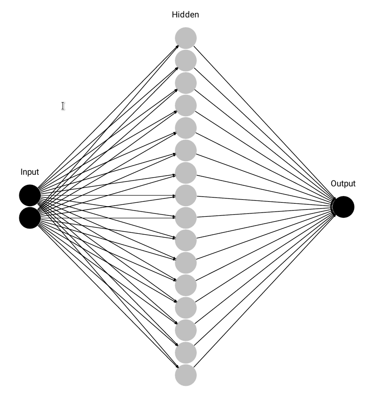
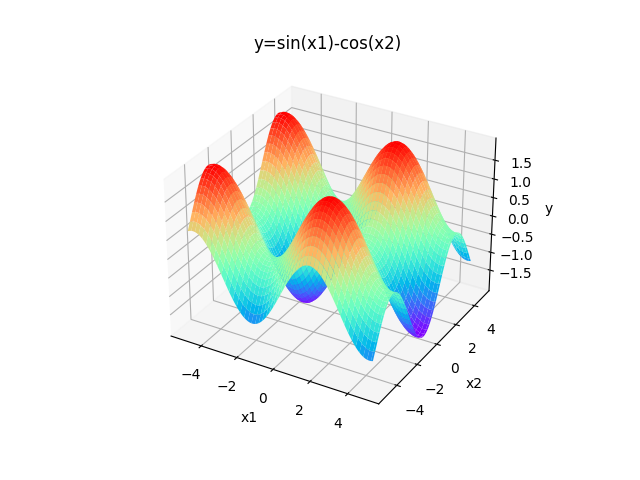
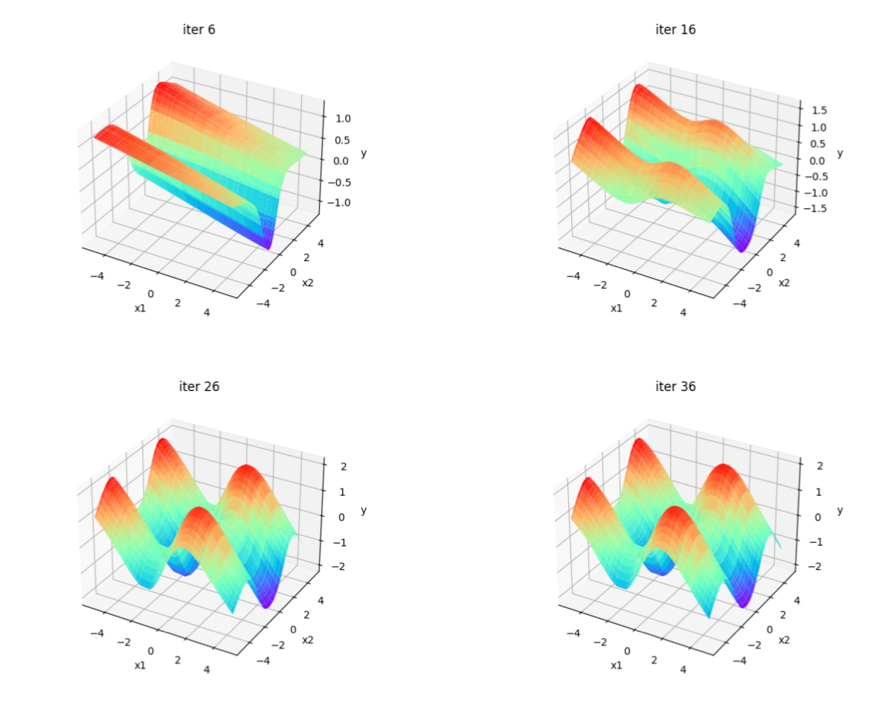

# 大作业一实验报告

*181220076 周韧哲*

### 网络设计

我实现的网络的接口风格类似于pytorch，与神经网络结构相关的代码都在Net.py中。

+ 在Net.py中，定义了线性层Linear，其中含有神经元权重w和偏置b，当输入x时，会返回O=xw+b，同时，也可以使用激活函数activation，调用activate会返回被激活后的矩阵A=Activation(x)​。为了方便计算反向传播过程，在其中保存了中间结果O和A​。

  ```python
  class Linear(object):
      def __init__(self, input_dim, output_dim):
          self.w = np.random.randn(input_dim, output_dim)*0.1
          self.b = np.random.randn(1, output_dim)*0.1
      def __call__(self, x):
          self.inputs = x
          res = np.dot(x, self.w) + self.b
          self.O = res
          return res
      def activate(self, x, activation):
          res = activation(x)
          self.A = res
          return res     
      def update(self, delta_w, delta_b, lr):
          self.w -= lr*delta_w
          self.b -= lr*delta_b
  ```

+ 定义了损失函数MSELoss，输入x和targets，它会计算两者的均方误差和误差梯度并返回。

  ```python
  class MSELoss(object):
      def __call__(self, x, targets):
          targets = targets.reshape(x.shape)
          assert(x.shape==targets.shape)
          self.loss = ((x-targets)**2/2).mean(axis=0,keepdims=True)
          self.lossD = (x-targets).mean(axis=0,keepdims=True)
          return self.loss, self.lossD
  ```

+ 定义了四种激活函数和相应的梯度：Tanh, Relu, Sigmoid, Line。其中Line(x)=x，用作神经网络最后一层输出的激活函数。

+ 定义了类NN，实现了全连接神经网络。

  ```python
  def __init__(self, input_dim, hidden_dim, output_dim, activation,                          hidden_layer_num, lr)
  ```

  可自定义输入维度input_dim, 输出维度output_dim，隐藏层维度hidden_dim，隐藏层数量hidden_layer_num，学习率lr。所有的线性层在初始化时都被保存在列表 self.nnSequence 里。前n-1个线性层的激活函数是被指定的activation（可以是Tanh，Relu或者Sigmoid），最后一层的激活函数是Line，即相当于没有激活函数，这是为了令网络的输出适应标签，在该任务中$y=\sin(x_1)-\cos(x_2)\in [-2, 2]$。

  + 其前向过程如下：

    ```python
    def forward(self, inputs):
        outputs = inputs 
        for i in range(self.hidden_layer_num+1):
            neuron = self.nnSequence[i]
            outputs = neuron(outputs)
            activation = self.activation if i<self.hidden_layer_num                                          else self.last_activation
            outputs = neuron.activate(outputs, activation)
        return outputs
    ```

    从self.nnSequence中取出各个线性神经元计算输出O=xw+b，然后通过激活函数A=Activation(O)。这时各个线性神经元中已经保存了O与A，以便反向传播时计算梯度。

  + 其反向传播过程如下：

    ```python
    def backward(self, lossD):
        last_value = lossD.copy()
        for i in range(self.hidden_layer_num, -1, -1):
            neuron = self.nnSequence[i]
            activationD = self.activationD if i<self.hidden_layer_num                                          else self.last_activationD
            tmp = np.multiply(last_value, activationD(neuron.A))
            delta_w = np.dot(neuron.inputs.T,tmp)
            delta_b = tmp
            self.nnSequence[i].update(delta_w, delta_b, self.lr)
            last_value = tmp.dot(neuron.w.T)
    ```
    lossD是损失函数对网络前向结果的梯度。last_value为上一层传下来的导数，在第k层，已知O=xw+b，A=f(O)，则Loss对w和b的梯度计算如下：
    $$
    \frac{\partial Loss}{\partial w}=\text{last_value} * \frac{\partial A}{\partial O}*\frac{\partial O}{\partial w}=\text{last_value}*\text{activationD}(A)*x\\
      \frac{\partial Loss}{\partial w}=\text{last_value} * \frac{\partial A}{\partial O}*\frac{\partial O}{\partial b}=\text{last_value}*\text{activationD}(A)\\
        \text{last_value} = \text{last_value}*\frac{\partial A}{\partial O}*\frac{\partial O}{\partial x}=\text{last_value}*\text{activationD}(A)*w
    $$
    我们只需要保证last_value为Loss对当前层激活输出的导数，就可以递归地使用上面的式子计算神经元的权重梯度，从代码中也可以清楚地看出来。
+ 实现了单个样例的训练过程，调用函数为fit：
  ```python
  def fit(self, inputs, targets, criterion):
      outputs = self.forward(inputs) 
      loss, lossD = criterion(outputs, targets)
      self.backward(lossD)
      return loss
  ```
  其中criterion为损失函数，通过forward计算前向过程的输出outputs，然后计算outputs和targets的loss以及loss的梯度lossD，将lossD反向传播至各层神经元，最终返回loss。
  同时，我也将整体的训练过程封装成了函数train：
  ```python
  def train(self, X, Y, num_iters, criterion):
      for i_iter in range(num_iters):
          losses = 0
          for i in range(X.shape[0]):
              x, y = X[i].reshape(1,-1), Y[i].reshape(1,-1)
              loss = self.fit(x,y,criterion)
              losses += loss[0][0]
          print('iter {}, loss {}'.format(i_iter,losses/X.shape[0]))
  ```
### 函数拟合任务
完成了Net.py中的内容后，很容易就可以实现一个回归任务：
```python
X, Y = generate_data()
nn=NN(input_dim=X.shape[1], hidden_dim=10, output_dim=Y.shape[1], activation='sigmoid', hidden_layer_num=2, lr=1e-2)
criterion = MSELoss()
nn.train(X,Y,iter_nums=100,criterion=criterion) 
pred = nn.predict(X)    #返回训练好的网络对X的预测值
```
我们需要拟合函数$y=\sin(x_1)-\cos(x_2)$，首先生成训练数据 (详见main/generate_data) ，然后就可以按照上面的回归任务的实现来设计神经网络对该函数的拟合：
```python
X, Y = generate_data(args.data_nums)
nn=NN(args.input_dim, args.hidden_dim, args.output_dim, args.activation, args.hidden_layer_num, args.lr)
criterion = MSELoss()
nn.train(X,Y,args.iter_nums,criterion)
```
这里，我设计了隐藏层维度为16，隐藏层个数为1，激活函数使用了sigmoid函数，迭代次数为36次，学习率设置为0.01。其网络结构图如下：



$y=\sin(x_1)-\cos(x_2)$的曲面图为：



我们对10000条数据的预测值形成的曲面图在不同训练过程为：



最后的误差约为0.0064。可以直观看出，在迭代次数足够多时，该神经网络已经很好地拟合了该函数。通过调整不同的隐藏层个数、隐藏层维度、激活函数类型、学习率等，可以获得精度更高的网络。

该神经网络虽然只有一个隐藏层，隐藏层维度为16，但已经展示出了其拟合非线性函数的巨大威力。这是因为理论上来说，只要神经元个数足够多，单隐层的神经网络具有拟合任何函数的能力。通过隐藏层神经元的线性变换和激活函数的非线性变换后，该网络已经能学习到输出空间的信息，通过强大的BP算法来逐步拟合目标输出。