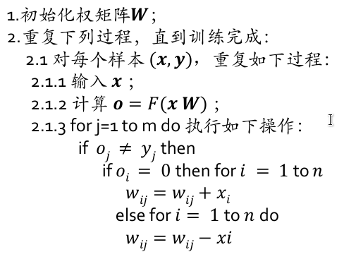

# 神经网络 

## 第一讲

+ 对脑的研究可以促进人工神经网络的研究，对人工神经网络的研究,也可以反过来促进对大脑的研究
+ 意识是人脑对大脑内外表象的觉察，人的头脑对于客观物质世界的反映,也是感觉、思维等各种心理过程的总和
+ 大脑是如何工作的
  + 颅相学解释：不同的大脑功能存在于分立的脑区
  + 聚集场理论：大脑作为一个整体参与行为，语言和记忆等专门化的加工不是由特定的脑区完成，特定脑区的损伤并不引起特定的行为缺陷
  + 折中观点：尽管特定的神经区域负责某项独立的功能,但这些区域组成的网络以及他们之间的相互作用才是人类表现出的整体、综合行为的原因

+ 人工神经网络
  + 由一些简单的处理单元(神经元)组成，能够保存经验知识，并且能够利用这些经验知识完成一些任务通过“学习”来从环境中积累知识,知识被保存在神经元之间的连接上
  + 有两个方面类似于人脑:
    + 知识由网络通过学习过程得到;
    + 神经元间的互联,用来存储知识的已知的联合权值
  + 神经网络的特点：
    + 面向神经元和联结性
    + 并行、分布处理结构
    + 非线性，可以模拟任意的数学模型

+ 符号主义和联结主义：

  

  

## 第二讲

### MP模型：

+ 输入$u=w_1x_1+\cdots+w_nx_n$，输出$y=f(\sum_{i=1}^nw_ix_i-\theta)$，$\theta$为阈值，当输入大于阈值时，神经元就兴奋。

+ 自变量及其函数的值、向量分量的值只取0和1函数、向量。

+ and神经元：

  

+ or神经元：W = 2,threshold = 2

+ and-not与非神经元 (x1 AND NOT x2 -> y) : W = 2, p = 1, threshold = 2

+ XOR异或神经元 = (x1 AND NOT x2) OR (x2 AND NOT x1)，见作业

  

### 线性模型

+ 线性回归：$h(x)=wx+b$，最小化均方误差$E=\frac{1}{n}\sum_{i=1}^n(h(x_i)-y_i)^2$，求导可得闭式解。
+ 多元线性回归：$h(\mathbf{x})=\mathbf{w}^T\mathbf{x}+b=\mathbf{\hat{w}}^T\mathbf{x}$，均方误差为$E=\frac{1}{n}||\mathbf{y}-h(\mathbf{x})||^2$。求导得$2\mathbf{X}^T(\mathbf{X}\mathbf{\hat{w}}-\mathbf{y})=0$。

+ 对数线性回归：$h(x)=e^{w^Tx+b}$.
+ 线性二分类：$h(x)=f(wx+b)$，其中f为单位阶跃函数，将输出映射到{0, 1}。
  + 多分类问题，输出神经元可以直接输出一个向量，作为类别的one-hot编码，多个输出神经元。

### 感知器神经元

+ $y=f(\sum_j^n w_jy_j+b)=f(u+b)$，一个神经元接收其他神经元的输出$y_j$，再apply激活函数，输出y

## 第三讲

+ 学习神经元权重的方法：

  + 随机学习：随机更新权重矩阵和偏置矩阵，考虑输出和真实值的误差，如果小于阈值，则可以更新，否则再加上一个很小的随机数，再重新判定。其思想简单，实现容易，且具有能找到全局最优解等特点

  + Hebbian学习：

    

    + 学习过程中，只有感知器对所有数据都进行了正确的分类权值才能移动：
      + 给定x, y，计算神经元输出t，计算误差E = t-y，如果是分类问题，此时分类正确就不用调整w，继续看下一个样本，否则：
      + $w_{new} = w_{old}+\beta*x*E$.

### 感知器学习算法

+ 梯度下降法：梯度的方向实际就是函数在此点上升最快的方向，而我们需要朝着下降最快的方向走，自然就是负的梯度的方向。
+ 学习率：太小可能导致迟迟走不到最低点或者无法跳出局部极小点；太大的话会导致错过最低点，无法稳定收敛。调整方法：
  + 学习率衰减、学习率预热、周期学习率、自适应调整学习率:AdaGrad,RMSprop,AdaDelta
  + 预热：在小批量梯度下降方法中，当批量大小设置的比较大时，通常需要较大的学习率，较大的学习率可能带来模型的不稳定，所以这两方面就发生了矛盾。
    + 在初始的几轮，采用较小的学习率，梯度下降到一定程度之后,再恢复到初始设置的学习率。
    + 逐渐预热：$\eta_t=\frac{t}{T}\eta_0$.
  + 困难：
    + 很难选择一个合适学习率
    + 对于所有的参数,均使用相同的学习率。不同参数的梯度大小有差异。
    + 很难跳出局部极值点，鞍点问题很难解决。

+ 两条定理表明误分类的次数k是有上界的，当训练数据集线性可分时，sign感知机学习算法迭代是收敛的。

### ADALINE

+ 激活函数为线性函数，试图最小化LMS

  

  只要学习率满足$0<\eta<\frac{2}{\lambda_{max}}$，$\lambda_{max}$为输入向量自相关矩阵的最大特征值，LMS算法就是按方差收敛的

+ 和感知器的比较：

  

  

## 第四讲

+ 多输出的单层感知器：在输出层上对每一个输出类有一个输出神经元

  训练过程：

  + 反复调整权值在相关输出神经元产生输出1，在其他剩余的神经元上产生输出0，将每一个输入模式映射到正确的输出类。

    

  + 对于连续的输出空间：

    

    

### 多级前馈网

+ 在输入层和输出层之间至少有一层(称之为隐藏层，hidden layer)
+ 只要神经元个数足够多，理论上单隐层的神经网络具有拟合任何函数的能力。(采样足够多的数据点)

## 第五讲

+ 多层前馈网的BP训练算法：

  

+ 基本BP算法的缺陷

  + 不同样例的更新的效果可能“抵消”
  + BP网络接受样本的顺序对训练结果有较大影响。它更“偏爱”较后出现的样本

+ 累积BP算法：

  + 针对累积误差最小化，读取整个训练集D后，才对参数进行更新
  + 好处：降低了参数更新的频率
  + 使用标准梯度下降算法

  

  

  + 较好地解决了因样本的顺序引起的精度问题和训练的抖动问题
  + 收敛速度比较慢

+ 设置冲量：

  

+ 局部极小点问题：

  + 不同的初始参数:从多个初始点开始进行搜索。
  + 模拟退火:以一定概率接受比当前结果更差的解。
  + 随机梯度下降:计算梯度值时,加入了随机因素,极小值点处计算的梯度不为0,有机会跳出局部极小。

+ 网络瘫痪问题
  + 在训练中,权可能变得很大,这会使神经元的网络输入变得很大,从而又使得其激活函数的导函数在此点上的取值很小。根据相应式子,此时的训练步长会变得非常小,进而将导致训练速度降得非常低,最终导致网络停止收敛

+ 步长问题
  + BP网络的收敛是基于无穷小的权修改量
  + 步长太小,收敛就非常慢
  + 步长太大,可能会导致网络的瘫痪和不稳定
  + 自适应步长,使得权修改量能随着网络的训练而不断变化。

## 第六讲

+ 不同维度差异过大(数据中心偏置)、正负例样本不均衡、梯度消失/梯度爆炸，解决手段有：
  + 正则化,规一化
  + 预训练和迁移学习
  + 特征预处理(特征工程)
+ 从给定的特征集合中选出相关特征子集的过程称为特征选择。特征选择可能会降低模型的预测能力,因为被剔除的特征中可能包含了有效的信息,抛弃这部分信息一定程度上会降低模型的性能。但这也是计算复杂度和模型性能之间的取舍

+ 过拟合:模型过于复杂,参数过多或训练数据过少,噪声过多。
+ 欠拟合:模型比较简单,特征维度过少。
+ 偏差:衡量模型预测值和实际值之间的偏离关系,即模型在样本上拟合得好不好。
+ 方差:描述模型在整体数据上表现的稳定情况,在训练集和验证集/测试集上表现是否一致。

+ 正则化:通过限制模型的复杂度,避免过拟合,提高泛化能力。
  + L1正则化：$\min_\theta L(x,y,\theta)+\lambda||\theta||_1$，梯度多了一个$\lambda sign(\theta)$，使$\theta$更容易为0,权重矩阵更为稀疏，抑制过拟合。
  + L2正则化：$\min_\theta L(x,y,\theta)+\lambda||\theta||_2$，使权重变得更小
  + 权重衰减法：每次参数更新时，都先对参数进行一定衰减$\theta:=(1-w)\theta-\alpha d\theta$
  + 丢弃法：在训练时,以概率p随机丢弃部分神经元。
    + 相当于取平均的作用,取每次丢弃后子网络的平均结果。
    + 降低神经元之间的敏感度,增加整体鲁棒性。
  + 提前停止：验证集错误率基本不下降时或有反增趋势时,可以提前停止训练。
  + 数据增强：在不实质增加数据的情况下,对当前数据执行一些操作达到数据增加的效果
    + 图像数据:翻转、旋转、镜像、裁剪、增加高斯白噪声等

+ 归一化：

  + min-max归一化、Z-score归一化

  + BatchNormalization批归一化：逐层归一化方法,对神经网络中任意的中间层进行归一化操作,使得净输入的分布一致(例如正态分布),一般应用在激活函数之前

    

  + Layer Normalization层归一化:对中间层的所有神经元进行归一化

  + 实例归一化Instance Normalization：主要用于依赖于某个图像实例的任务

    输入有四个维度：N:batch维度,C:特征通道维度,H、W:特征图高和宽维度。对每个样本的H和W的数据求均值和标准化,保留N、C维度

  + 组归一化Group Normalization：把特征通道分为G组,每组有C/G个特征通道,在组内归一，是层归一化和实例归一化的折中

  + 可转换归一化Switchable Normalization：将批归一化、层归一化、实例归一化结合起来的方法,使网络自适应学
    习如何组合起来的权重。

+ 初始化：好的初始化值能够帮助网络更快地计算得到最优值，更容易收敛到目标函数。不合理的初始化会导致梯度消失或爆炸现象
  + 均匀分布初始化：在区间(-r,r)的均匀分布U(-r,r)中随机选取所有网络权值
  + 高斯分布初始化：在固定均值和固定方差的高斯分布中随机选取所有网络权值
  + 稀疏初始化：稀疏初始化降低连接数量,使得初始化的数值不会太小
  + 正交初始化：可以避免训练开始时就出现梯度消失或梯度爆炸现象
  + 偏置矩阵初始化：通常可以把偏置矩阵初始化为全0矩阵

+ 网络预训练：采用相同结构的,并且已经训练好的网络权值作为初始值,在当前任务上再次进行训练

  + 为了能够在更短时间内训练得到更好的网络性能
  + 相似的任务之间,训练好的神经网络可以复用,通常作为特征提取器

  无监督预训练：通过无标签数据辅助神经网络的训练

  + 玻尔兹曼机
  + 自编码器(Auto-encoder,AE)是无监督的全连接网络结构,其训练目标为重构误差最小化

  有监督预训练

  + 迁移学习：通过大量带标签的数据集,大幅减少网络收敛的训练时间。使用大型数据集预训练网络,可以使网络在其它任务上发挥更好的效果

    使用预训练模型的方式

    + 直接作为特征提取网络:即将网络直接用于数据的特征提取,将输出作为特征,根据任务目标进行后续的分类、回归等操作，不再对这些预训练层进行进一步的学习,可以看作预训练模型“冻结(frozen)”了
    + 作为初始化模型进行微调:部分或全部使用这个模型作为初始化模型,根据手头的数据对这个模型进行再次训练,这个过程被称为“精调(fine-tune)”

## 第七讲

+ 动力系统：

  

  + 稳定性和收敛性：

    

  + 若平衡态 V 是稳定的、收敛的,则该平衡态被称为渐进稳定。

  + 若平衡态 V 是稳定的,且当时间无穷大时,所有的系统轨线均收敛于V，则此平衡态是渐进稳定的

  + Lyapunov函数

### 离散Hopfield网络

+ 离散Hopfield网络是单层全互连的，神经元可取二值{0/1}或{−1/1}。任意神经元i与j间的突触权值为$W_{ij}$，神经元之间联接是对称的,即$W_{ij}=W_{ji}$，神经元自身无联接,$W_{ii}=0$。
  + 每个神经元都同其它的神经元相连
  + 每个神经元都将其输出通过突触权值传递给其它的神经元,同时每个神经元又都接收其它神经元传来的信息
  + 对每个神经元来说,其输出信号经过其它神经元后又有可能反馈给自己,所以Hopfield网络是一种反馈神经网络。

+ Hopfield网络中有n个神经元，其中任意神经元i的输入用$u_i$表示，输出用$v_i$表示，它们都是时间的函数，其中$v_i(t)$也称为神经元i在t时刻的状态
  $$
  u_i(t)=\sum_{j=1,j\neq i}^n w_{ij}v_j(t)+b_i\\
  v_i(t+1)=f(u_i(t))
  $$
  激励函数f可以为阶跃函数或符号函数。

+ 运行方式：

  串行：在任一时刻t，只有某一神经元依上式变化，而其他神经元的状态不变。

  + 第一步：对网络进行初始化
  + 第二步：从网络中随机选取一个神经元i
  + 第三步：求出该神经元i的输入$u_i(t)$
  + 第四步：求出该神经元i的输出$v_i(t+1)=f(u_i(t))$，此时网络中的其它神经元的输出保持不变
  + 第五步：判断网络是否达到稳定状态，若达到稳定状态或满足给定条件，则结束；否则转到第二步继续运行。
  + 网络的稳定状态定义为：若网络从某一时刻以后，状态不再发生变化，则称网络处于稳定状态

+ Hopfield网络存在稳定状态 , 则要求Hopfield网络模型满足对称连接，神经元自身无连接。其能量函数定义为：
  $$
  E=-\frac{1}{2}\sum_{i=1,i\neq j}^n\sum_{j=1,j\neq i}w_{ij}v_iv_j+\sum_{i=1}^nb_iv_i
  $$
  网络中的任意神经元i的能量函数为$E_i=-\frac{1}{2}\sum_{j=1,j\neq i}w_{ij}v_iv_j+b_iv_i$，可以计算从t时刻到t+1时刻的能量变化量为
  $$
  \Delta E_i=-\frac{1}{2}[v_i(t+1)-v_i(t)][\sum_{j=1,j\neq i}^nw_{ij}v_j+b_i]=-\frac{1}{2}[v_i(t+1)-v_i(t)]u_i(t)
  $$
  当$u_i(t)\geq0$时，$v_i(t+1)=1$；当$u_i(t)<0$时，$v_i(t+1)=-1$，所以$\Delta E_i\leq0$。

  所以在满足参数条件下，Hopfield网络状态是向着能量函数减小的方向演化。由于能量函数有界，所以系统必然会趋于稳定状态，该稳定状态即为Hopfield网络的输出

  

+ 连续Hopfield神经网络：激励函数为连续函数，网络的输入、输出均为模拟量，各神经元采用并行(同步)工作方式

### 联想记忆

+ 联想记忆(Associative Memory)。Hopfield网络模拟了生物神经网络的记忆功能，也常常被称为联想记忆网络。可以分为
  + 自联想记忆(Auto-Associative Memory)
  + 异联想记忆(hetero-associative memory)

+ 联想记忆的工作过程分为两个阶段
  + 记忆阶段,也称为存储阶段或学习阶段
    + 在记忆阶段就是通过设计或学习网络的权值,使网络具有若干个稳定的平衡状态,这些稳定的平衡状态也称为吸引子(Attractor)。
    + 吸引子有一定的吸引域( Basin of Attraction)。吸引子的吸引域就是能够稳定该吸引子的所有初始状态的集合,吸引域的大小用吸引半径来描述,吸引半径可定义为:吸引域中所含所有状态之间的最大距离或吸引子所能吸引状态的最大距离，吸引域越大网络的容错性能越好,或者说网络的联想能力就越强
    + 吸引子也就是联想记忆网络能量函数的极值点,记忆过程就是将要记忆和存储的模式设计或训练成网络吸引子的过程。
    + 吸引子的数量代表着AM的记忆容量(Memory Capacity)或存储容量(Storage Capacity)
    + AM的吸引子越多,则网络的存储容量就越大
  + 联想阶段，给定输入模式,联想记忆网络通过动力学的演化过程达到稳定状态,即收敛到吸引子,回忆起已存储模式的过程。

+ 离散Hopfield网络的联想记忆功能：

  + 存储记忆过程：

    

    采用外积法设计网络的权值

    

  + 联想回忆过程：

    

+ Hopfield联想记忆网络运行步骤：（激励函数为符号函数）

  

  

+ Hopfield网络存在伪状态(Spurious States)，伪状态是指除记忆状态之外网络多余的稳定状态。

  

  

## 第八讲

随机神经网络

### 基本的非确定方法

+ 基本思想
  + 从所给的网络中“随机地选取一个联接权”
  + 对该联接权提出一个“伪随机调整量”
  + 当用此调整量对所选的联接权进行修改后
  + 如果“被认为”修改改进了网络的性能,则保留此调整；否则放弃本次调整。

### 模拟退火

+ 首先在高温下进行搜索,此时各状态出现概率相差不大,可以很快进入“热平衡状态”,这时进行的是一种“粗搜索”,也就是大致找到系统的低能区域;
  随着温度的逐渐降低,各状态出现概率的差距逐渐被扩大,搜索精度不断提高。这就可以越来越准确的找到网络能量函数的全局最小点。

+ 模拟退火与传统迭代最优算法的比较:
  + 当系统在非零温度下时,从局部最优中跳出是非常可能的,因此不会陷入局部最优。
  + 系统最终状态的总特征可以在较高温度下看到,而状态的好的细节却在低温下表现,因此,模拟退火是自适应的。

+ 原理：

  

  若能量差为正,算法在这一点进行概率操作。首先,选定一个在[0,1]内服从均匀分布的随机数$\epsilon$。如果$\epsilon<e^{-\frac{\Delta E}{T}}$,则接受这种转移。否则,拒绝这种转移;即在算法的下一步中拒绝旧的状态。如此反复,达到系统在此温度下的热平衡。

  Metropolis抽样过程就是在一确定温度下,使系统达到热平衡的过程。

  退火过程(降温过程):按照一定的降温方法得到一个新的温度T

+ 模拟退火用于组合优化问题算法实现:

  

  

  

### Boltzmann机

+ Boltzmann机由输入部、输出部和中间部构成。输入神经元和输出神经元可称为显见神经元,它们是网络与外部环境进行信息交换的媒介。中间部的神经元称为隐见神经元,它们通过显见神经元与外部进行信息交换。每一对神经元之间的信息传递是双向对称的,自身无反馈

+ 每个神经元的兴奋或抑制具有随机性,其概率取决于神经元的输入。

  神经元i的输入为$u_i=\sum_{j}^nw_{ij}v_j+b_i=\sum_{j}^nw_{ij}v_j(\text{merge b into w})$。输出依概率取1或0：$P(v_i=1)=\frac{1}{1+e^{-\frac{u_i}{T}}}$，。u越大v取1的概率越大，取0的概率越小。

  T越高时,曲线越平滑,因此,即使u有很大变动,也不会对v取1的概率变化造成很大的影响;反之,T越低时,曲线越陡峭,当u 有稍许变动时就会使概率有很大差异。即温度高时状态变化接近随机,随着温度的降低向确定性的动作靠近。

  当T趋于0时，Boltzmann机趋向于Hopfield网络。

+ 能量函数：
  $$
  E=-\frac{1}{2}\sum_{i,j}w_{ij}v_iv_j
  $$
  Boltzmann机在运行时,假设每次只改变一个神经元的状态，如第i个神经元，设$v_i$取0和取1时系统的能量函数分别为0和$-\sum_jw_{ij}v_j$，则他们的差值为$\Delta E_i=\sum_jw_{ij}v_j$

  

  网络状态取能量低的可能性大。运行过程中总的趋势是朝能量下降的方向运动,但也存在能量上升的可能性。

+ T 很高时,各状态出现的概率差异大大减小，也就是说网络停留在全局最小点的概率,并不比局部最小点的概率甚至非局部最小点高很多。

  T很低时,情况正好相反。概率差距被加大,一旦网络陷于某个极小点之后,虽然还有可能跳出该极小点,但是所需的搜索次数将是非常多的。这一点保证网络状态一旦达到全局最小点,跳出的可能性小

+ Boltzmann机的运行步骤
  + Boltzmann机结构：
    + n个随机神经元，第i个和第j个神经元的连接权值为$w_{ij}$，初始温度$T_0$，迭代次数M
  + 运行步骤：
    + 第一步：对网络进行初始化。设定初始温度$T_0$、终止温度$T_{final}$和阈值$\epsilon$和权重
    + 第二步：在温度$T_m$条件下，随机选取网络中的一个神经元i，计算其输入$u_i=\sum_{j=1,i\neq j}^nw_{ij}v_j+b_i$。
    + 第三步：若$u_i>0$，即能量差$\Delta E_i>0$，取$v_i=1$为神经元i的下一状态值。否则，计算概率$P_i=\frac{1}{1+e^{-\frac{u_i}{T}}}$
    + 第四步：判断网络在温度$T_m$下是否达到稳定，若未达到稳定，则继续在网络中随机选取另一神经元j转至第二步重复计算，直至网络在$T_m$下达到稳定。若网络在$T_m$下已达到稳定则转至第五步计算。
    +  第五步：以一定规律降低温度使$T_{m+1}<T_m$，若$T_{m+1}<T_{final}$，则运行结束。否则转至第二步。

+ Boltzmann机注意点
  + 初始温度的选择方法。初始温度$T_0$的选取主要有以下方法
    + 随机选取网络中k个神经元，选取这k个神经元能量的方差作为$T_0$
    + 在初始网络中选取使$\Delta E$最大的两个神经元，取$T_0$为$\Delta E_{max}$的若干倍
    + 按经验值给出等。
  + 确定终止温度阈值$T_{final}$的方法。主要根据经验选取，若在连续若干温度下网络状态保持不变，也可认为已达到终止温度。
  + 概率阈值$\epsilon$的确定方法。$\epsilon$的选取方法主要有：在网络初始化时按照经验确定或在网络每次运行过程中选取一个[0,0.5]之间均匀分布的随机数
  + 降温的方法。通常采用指数的方法进行降温：$T_{m+1}=\frac{T_0}{\log(m+1)}$

+ Boltzmann机的学习规则：根据最大似然规则，通过调整权值$w_{ij}$，最小化似然函数或其对数。